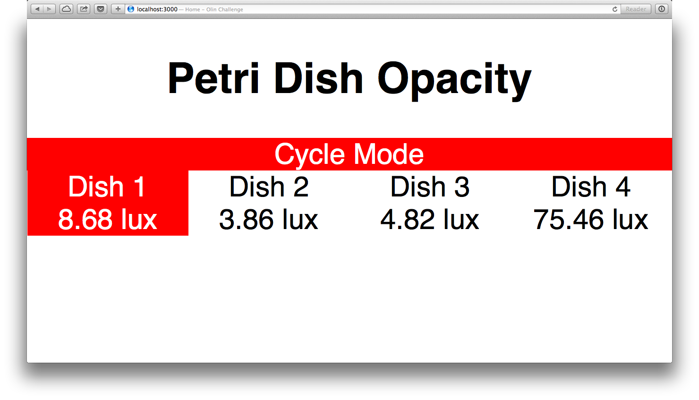
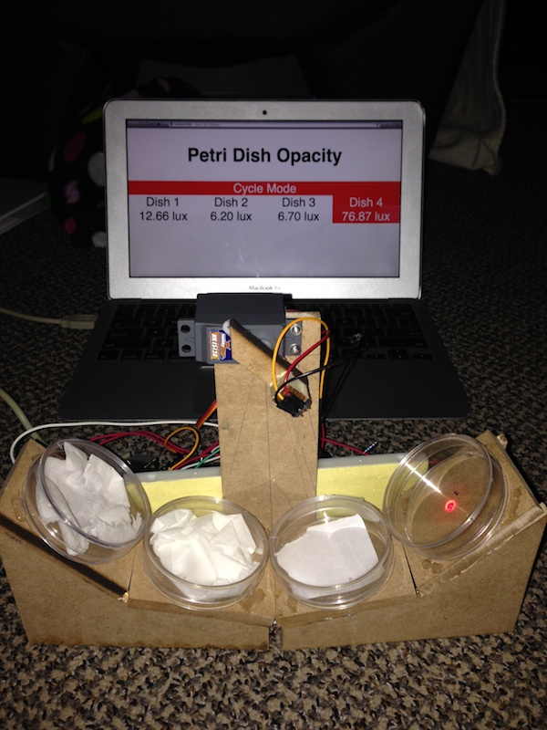
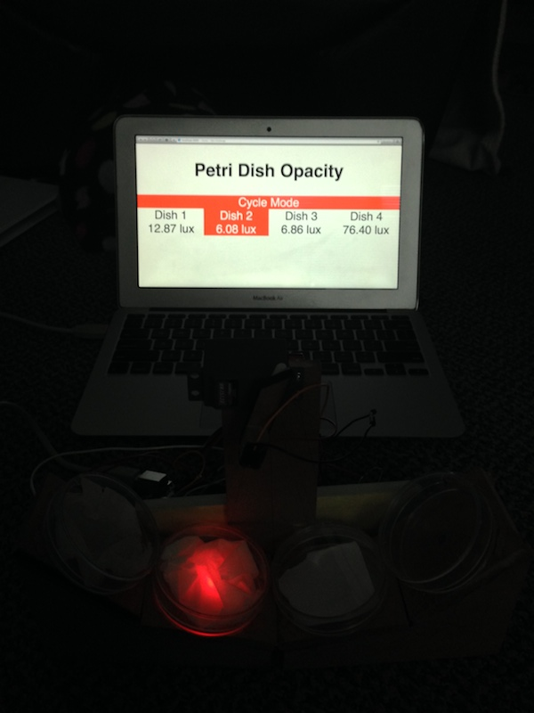

Petri Dish Opacity Tester
==========

POE Lab 2: Automated petri dish opacity tester

## Introduction

For the petri dish laboratory testing rig, we decided to use a node webserver to communicate with the Arduino via a serial port.

## Arduino

The Arduino code is in the arduino folder. The node server receives the request `PUT /dish/:dish` and sends `0`, `1`, `2`, or `3` through the serial port to the Arduino, which then calls `observeDish(dish)`. The function turns the servo to the dish's position and turns on the corresponding LED, waits, gathers data, waits, and turns the corresponding LED off. The Arduino averages and linearizes the data from the light sensor and sends a single value, with units lux, back through the serial port to be passed back to the frontend in the HTTP response to the original `PUT` request.

## Node

The node code is in the node folder. We used [express](https://github.com/visionmedia/express) for routing, as well as [node-serialport](https://github.com/voodootikigod/node-serialport) for serial communication. We chose to use node over python because it's simpler to make a simple user interface with HTML than with some python library that we didn't already know how to use coming into the project.

### "Hardware API"

The server is pretty straightforward: all the logic is in `node/app.js`. There is only one API route: collect data from a given dish.

- ### Serial Communication

	After initialising the serial port with the correct port name and baud rate (based on the Arduino's setting), an event listener is bound to the serial port's "data" event. Data is unshifted onto the `serialData` array to be popped off when it is read; this is done to mirror the behavior of the serial buffer, since data is captured asynchronously by node-serialport.

- ### Asynchronous Data Capture

	A nice model for this "hardware API" would be to `PUT` to the desired dish, and receive the reading for it in the HTTP response. However, since data is captured asynchronously, we can't rely on the data being ready before the route callback ends execution. Rather than dealing with more event listeners, callbacks, or whatever else we would have needed, we just decided to delay long enough to be pretty sure that we should have gotten data back from the serialport before reading it in and sending it back in the response. We ensure that we don't get stuck in a loop when `serialData` gets overfilled with commands with this loop:

		while (serialData.length)
			data = serialData.pop();
			
## Frontend

All the frontend logic is in `node/app/js/dish.js`. We bound click events to the dish buttons to send the correct requests to the server, and handled the looping for automatic mode in the frontend. We made the latter choice for a couple of reasons:

- It simplified the API to a single route.
- It allowed us to gather data in automatic mode without pause. If we have a request for each dish, we have a response for each dish, which makes data collection straightforward. We don't have to deal with data coming in at arbitrary times with no request callback waiting for it.

And the original motivation for using node was validated! We quickly created a clean, straightforward user interface for the device.

The [jade](https://github.com/visionmedia/jade) templates and [stylus](https://github.com/LearnBoost/stylus) stylesheets are outside the scope of this project, but I'm just mentioning them because I think the languages are awesome. 

## Results

It worked! Clicking a button caused the servo to turn to the corresponding dish and take a measurement. With the right port forwarding, this thing could take commands from the world wide web!

It works best in the dark.

